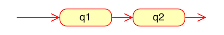
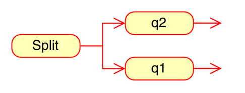
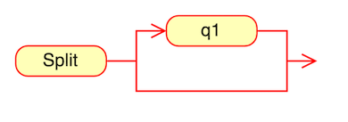
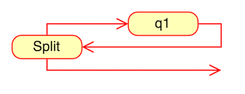
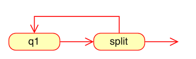

# Regex-Engine

A C language regex engine using NFA based on Ken Thompson's 1968 CACM paper.  
This implementation compiles Regular Expressions to Non-Deterministic Finite Automata (NFA) using Thompson's Construction algorithm.

[]()
[]()
[](LICENSE)

## 🚀 Quick Start

```bash
# Build the project
make

# Run tests (61 comprehensive tests)
make test

# Use the interactive CLI
./regex 'pattern' 'text'

# Examples
./regex 'hello' 'hello'              # ✓ MATCH
./regex '(cat|dog)+' 'catdogcat'     # ✓ MATCH
./regex '(0|1)*' '01010'             # ✓ MATCH (binary string)
./regex 'a+b' 'b'                    # ✗ NO MATCH
```

## 📋 Features

- ✅ **Fully Working** - All critical bugs fixed
- ✅ **Well Tested** - 61 comprehensive tests with 100% pass rate
- ✅ **Interactive CLI** - Test patterns from the command line
- ✅ **Clean Build** - Compiles without warnings
- ✅ **Educational** - Clear implementation of Thompson's algorithm

### Supported Operators

| Operator | Description      | Example | Matches          |
| -------- | ---------------- | ------- | ---------------- |
| Literal  | Exact character  | `abc`   | "abc"            |
| `*`      | Zero or more     | `a*`    | "", "a", "aaa"   |
| `+`      | One or more      | `a+`    | "a", "aaa"       |
| `?`      | Zero or one      | `a?`    | "", "a"          |
| `\|`     | Alternation (OR) | `a\|b`  | "a" or "b"       |
| `()`     | Grouping         | `(ab)*` | "", "ab", "abab" |

See [CLI_USAGE.md](CLI_USAGE.md) for detailed examples and usage guide.

---

## Regex Engine Steps:

1. [Parse](#parse)
2. [Construction](#construction)
3. [Match](#match)
4. [Improvements](#improvements)
5. [References](#references)

---

### Parse

In thompson`s paper the compiler builds an NFA from a regular expression in postfix notation with dot (.) added as an explicit concatenation operator.

Therefor the parser steps are:

1. Adding an explicit concatenation operator - the '.' character will be used as in thompson\`s paper. The implementation is in the `insertExplicitConcatOperator` function.

2. Converting the expression from infix notation to postfix notation. The implementation is in the `infixToPostfix` function.
   The convertion itself is sing the Shunting-Yard Algorithm.

###### What is the Shunting-Yard Algorithm?

This algorithm is an operator-precedence parser that is specifically designed to parse mathematical expressions into postfix notation for computation. Postfix notation (Reverse Polish notation) is a mathematical notation in which the operators follow the numbers.

###### Code: /src/parse.c

---

### Construction

Using Thomapson`s construction Algorithm we convert the postfix expression into a NFA structure

###### What is Thomapson`s construction Algorithm?

Thompson's Construction is a method in which we transform a regular expression
into a (NFA) non-deterministic finite automaton.
This can further be used to match strings against the expression.

###### NFA representation:

The NFA structure is defined in `src/common/data_structures/nfa.c`:

```c
typedef struct State
{
    int c;  // State type: c<256 for character, c=256 for split, c=257 for match
    struct State *out, *out1;  // Pointers to next states
    int lastlist;  // Used during NFA execution
}NFA, *NfaPtr;
```

State can represent three types of NFA fragments, depending on c values:


###### Construction process:

The compiler scans the postfix expression, it maintains a stack of computed NFA fragments.

Literals push new NFA fragments onto the stack, while operators pop fragments off the stack and then push a new fragment.

For example, after compiling the abb in abb.+.a., the stack contains NFA fragments for a, b, and b. The compilation of the . that follows pops the two b NFA fragment from the stack and pushes an NFA fragment for the concatenation bb..

Each NFA fragment is defined by its start state and its outgoing arrows:

```angular2html
typedef struct Frag
{
NfaPtr start;     // start NFA state
StateListPtr out; // out is a list of pointers to State* pointers that are not yet connected to anything
                  // Actually the list is a list of out & out1 from the State structure
}Frag, * FragPtr;
```

The compilation options for regex are:

- Literals - Pushes a new fragment to the stack

  

- Operators:
  - '.' - The concat, connecting 2 states
    
  - '|' (Alternation) - Connecting 2 states with a "parent" split state
    
  - '?' (zero or one) - Connecting a state with a "parent" split state and the second state is an epsilon (no character needed)
    
  - '\*' (zero or more) - Same as '?' (zero or more) but q1 connects to the 'parent' so the state can repeat itself (there can be another character)
    
  - '+' (one or more) - Creates a "child" split state between its "parent" state (the state before) and the next state. Meaning a split between an epsilon to the state before and an option for the next character.
    

An easy to understand visual explanation can be found here: https://medium.com/swlh/visualizing-thompsons-construction-algorithm-for-nfas-step-by-step-f92ef378581b

###### Code:

- construction: /src/construction.c
- NFA structure: /src/data_structures/nfa.c

---

### Match

Then using the nfa that represents the regex we can run our input string and return if the input maches the regex or not

---

## 🔨 Building

### Requirements

- GCC compiler
- Make

### Commands

```bash
make          # Build both test suite and CLI tool
make test     # Run all 61 tests
make clean    # Remove build artifacts
```

### Build Outputs

- `./regex_engine` - Automated test suite
- `./regex` - Interactive CLI tool

## ✅ Testing

The project includes a comprehensive test suite with **61 tests** covering:

- Basic literal matching
- All repetition operators (`*`, `+`, `?`)
- Alternation (`|`)
- Complex nested patterns
- Edge cases and intentional failures
- Multi-character patterns
- Numeric and mixed characters

Run tests:

```bash
make test
```

**Result: 61/61 PASSING** ✅

## 📚 Documentation

- [CLI_USAGE.md](CLI_USAGE.md) - Comprehensive usage guide with examples
- [Implementation Details](#regex-engine-steps) - See sections below

## 🐛 Bugs Fixed

This implementation previously had critical bugs that have been fixed:

1. ~~Syntax error~~ ✅ Fixed
2. ~~Infinite loop in construction~~ ✅ Fixed
3. ~~Swapped MATCH/SPLIT constants~~ ✅ Fixed
4. ~~Type mismatch (char → int)~~ ✅ Fixed
5. ~~Pointer dereferencing bug~~ ✅ Fixed

All tests now pass with zero warnings.

### Future Improvements

1. NFA representation as transition tables
2. Caching the NFA to build a DFA
3. Character classes (`[a-z]`, `\d`)
4. Anchors (`^`, `$`)
5. Escape sequences

### References

- Thompson's Original Paper: https://dl.acm.org/doi/10.1145/363347.363387
- Russ Cox's Article: https://swtch.com/~rsc/regexp/regexp1.html
- Visual Explanation: https://medium.com/swlh/visualizing-thompsons-construction-algorithm-for-nfas-step-by-step-f92ef378581b

---

## 📝 License

MIT License - See [LICENSE](LICENSE) for details
