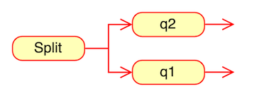

# Regex-Engine
A C lang regex engine using NFA based on Ken Thompson`s paper
It was introduced in his 1968 CACM paper.
This implementation compiles Regular Expressions to Non-Deterministic Finite Automatas (NFA)

Currently, this implementation only implements the repetition metacharacters ('+', '?', '*') and concatenation/alteration ("AND"/"OR")
> **:warning: Warning**: WIP. Do not use in a production environment.

# <ins>This is a work in progress!!!


## Regex Engine Steps:

1. [Parse](#parse)
2. [Construction](#construction)
3. [Match](#match)
4. [Improvements](#improvements)
5. [References](#references)

--------


### Parse
In thompson`s paper the compiler builds an NFA from a regular expression in postfix notation with dot (.) added as an explicit concatenation operator.

Therefor the parser steps are:
1. Adding an explicit concatenation operator - the '.' character will be used as in thompson\`s paper. The implementation is in the `insertExplicitConcatOperator` function.


2. Converting the expression from infix notation to postfix notation. The implementation is in the `infixToPostfix` function.
The convertion itself is sing the Shunting-Yard Algorithm.

###### What is the Shunting-Yard Algorithm?
This algorithm is an operator-precedence parser that is specifically designed to parse mathematical expressions into postfix notation for computation. Postfix notation (Reverse Polish notation) is a mathematical notation in which the operators follow the numbers.

######  Code: /src/parse.c

---------------------------------


### Construction
Using Thomapson`s construction Algorithm we convert the postfix expression into a NFA structure

###### What is Thomapson`s construction Algorithm?

Thompson's Construction is a method in which we transform a regular expression
into a (NFA) non-deterministic finite automaton.
This can further be used to match strings against the expression.

###### NFA representation:
In /src/data_structures/nfa.c there is a structure that represent the NFA
```angular2html
typedef struct State
{
    char c; // Represents the char c<256 | c=256 in ascii represents a split | c=256 represents a match
    struct State *out, *out1; // Pointer to one of the next states | Pointer to the second of the next states
    int lastlist; // Lastlist is used during execution and is explained in the next section.
}NFA,* NfaPtr;
```

State can represent three types of NFA fragments, depending on c values:


###### Construction process:

The compiler scans the postfix expression, it maintains a stack of computed NFA fragments.

Literals push new NFA fragments onto the stack, while operators pop fragments off the stack and then push a new fragment.

For example, after compiling the abb in abb.+.a., the stack contains NFA fragments for a, b, and b. The compilation of the . that follows pops the two b NFA fragment from the stack and pushes an NFA fragment for the concatenation bb..

Each NFA fragment is defined by its start state and its outgoing arrows:
```angular2html
typedef struct Frag
{
NfaPtr start;     // start NFA state
StateListPtr out; // out is a list of pointers to State* pointers that are not yet connected to anything
                  // Actually the list is a list of out & out1 from the State structure
}Frag, * FragPtr;
```

The compilation options for regex are:
* Literals - Pushes a new fragment to the stack

    

* Operators:
  * '.' - The concat, connecting 2 states
    
  * '|' (Alternation) - Connecting 2 states with a "parent" split state
    
  * '?' (zero or one) - Connecting a state with a "parent"  split state and the second state is an epsilon (no character needed)
    
  * '*' (zero or more) - Same as '?' (zero or more) but q1 connects to the 'parent' so the state can repeat itself (there can be another character)
    
  * '+' (one or more) - Creates a "child" split state between its "parent" state (the state before) and the next state. Meaning a split between an epsilon to the state before and an option for the next character.
    

An easy to understand visual explanation can be found here: https://medium.com/swlh/visualizing-thompsons-construction-algorithm-for-nfas-step-by-step-f92ef378581b

###### Code:
* construction: /src/construction.c
* NFA structure: /src/data_structures/nfa.c

----------

### Match
Then using the nfa that represents the regex we can run our input string and return if the input maches the regex or not


----------------

### Improvements
1. NFA representation as transition tables
2. Caching the NFA to build a DFA


### References
* https://dl.acm.org/doi/10.1145/363347.363387
* https://swtch.com/~rsc/regexp/regexp1.html